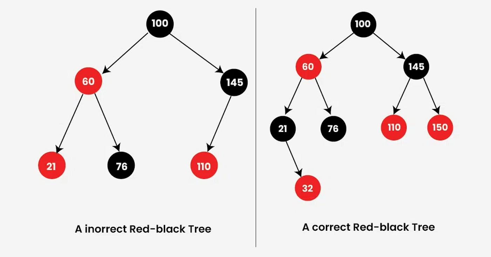

###  Red-Black Trees (Self-Balancing Binary Search Trees)

A **Red-Black Tree** is a special type of **Binary Search Tree (BST)** that is **self-balancing**, ensuring efficient operations.


###  1. Definition

A **Red-Black Tree** is a BST where each node has a color (**RED or BLACK**) and satisfies rules that keep the tree balanced.

<p align="center">

</p>


###  2. Properties of Red-Black Trees

1. Each node is either **RED or BLACK**
2. The **root node is always BLACK**
3. All **leaf nodes (NIL/null)** are BLACK
4. A **RED node cannot have a RED child**
5. Every path from a node to its descendant NIL nodes has the **same number of BLACK nodes**
6. The tree remains approximately balanced → height = **O(log n)**
7. Follows standard **BST ordering rules**


### 3. Red-Black Tree Node

Each node stores:
- value
- left child
- right child
- parent
- color

```java
class RBNode {
    int value;
    RBNode left;
    RBNode right;
    RBNode parent;
    boolean color; // true = RED, false = BLACK

    public RBNode(int value) {
        this.value = value;
        this.color = true; // New nodes are RED
        left = null;
        right = null;
        parent = null;
    }
}
```

### 4. Red-Black Tree Class

The Red-Black Tree class stores the **root node** and manages the tree.

Steps:

1. Create a class to represent the Red-Black Tree
2. Declare a root node
3. Initialize the tree as empty
4. Add a method to check if the tree is empty


```java
class RedBlackTree {
    RBNode root;

    public RedBlackTree() {
        root = null;
    }

    public boolean isEmpty() {
        return root == null;
    }
}
```

### 5. Insert Operation (Red-Black Tree)

Insertion follows two stages:
1. Insert like a normal BST
2. Fix violations to maintain Red-Black properties

Steps:

1. Create a new node (always RED)
2. Insert the node using BST rules
3. Call a method to fix any violations


```java
public class RedBlackTree {
    RBNode root;

    public RedBlackTree() {
        root = null;
    }

    public boolean isEmpty() {
        return root == null;
    }

    public void insert(int value) {
        RBNode node = new RBNode(value);
        root = bstInsert(root, node);
        fixViolation(node);
    }

    private RBNode bstInsert(RBNode root, RBNode node) {
        if (root == null)
            return node;

        if (node.value < root.value) {
            root.left = bstInsert(root.left, node);
            root.left.parent = root;
        } else if (node.value > root.value) {
            root.right = bstInsert(root.right, node);
            root.right.parent = root;
        }

        return root;
    }

}
```


---

### 6. Left Rotation

Used to fix imbalance by rotating nodes to the left.

Steps:

1. Set right child as new parent
2. Move left subtree of right child
3. Update parent links
4. Attach rotated nodes


```java
public class RedBlackTree {
    RBNode root;

    public RedBlackTree() {
        root = null;
    }

    public boolean isEmpty() {
        return root == null;
    }

    public void insert(int value) {
        RBNode node = new RBNode(value);
        root = bstInsert(root, node);
        fixViolation(node);
    }

    private RBNode bstInsert(RBNode root, RBNode node) {
        if (root == null)
            return node;

        if (node.value < root.value) {
            root.left = bstInsert(root.left, node);
            root.left.parent = root;
        } else if (node.value > root.value) {
            root.right = bstInsert(root.right, node);
            root.right.parent = root;
        }

        return root;
    }
    private void rotateLeft(RBNode x) {
        RBNode y = x.right;
        x.right = y.left;
        if (y.left != null)
            y.left.parent = x;

        y.parent = x.parent;

        if (x.parent == null)
            root = y;
        else if (x == x.parent.left)
            x.parent.left = y;
        else
            x.parent.right = y;
        y.left = x;
        x.parent = y;
    }

}
```


---

### 7. Right Rotation

Used to fix imbalance by rotating nodes to the right.

Steps:

1. Set left child as new parent
2. Move right subtree of left child
3. Update parent links
4. Attach rotated nodes


```java
public class RedBlackTree {
    RBNode root;

    public RedBlackTree() {
        root = null;
    }

    public boolean isEmpty() {
        return root == null;
    }

    public void insert(int value) {
        RBNode node = new RBNode(value);
        root = bstInsert(root, node);
        fixViolation(node);
    }

    private RBNode bstInsert(RBNode root, RBNode node) {
        if (root == null)
            return node;

        if (node.value < root.value) {
            root.left = bstInsert(root.left, node);
            root.left.parent = root;
        } else if (node.value > root.value) {
            root.right = bstInsert(root.right, node);
            root.right.parent = root;
        }

        return root;
    }
    private void rotateLeft(RBNode x) {
        RBNode y = x.right;
        x.right = y.left;
        if (y.left != null)
            y.left.parent = x;

        y.parent = x.parent;

        if (x.parent == null)
            root = y;
        else if (x == x.parent.left)
            x.parent.left = y;
        else
            x.parent.right = y;
        y.left = x;
        x.parent = y;
    }

    private void rotateRight(RBNode y) {
        RBNode x = y.left;
        y.left = x.right;

        if (x.right != null)
            x.right.parent = y;

        x.parent = y.parent;

        if (y.parent == null)
            root = x;
        else if (y == y.parent.left)
            y.parent.left = x;
        else
            y.parent.right = x;

        x.right = y;
        y.parent = x;
    }

}
```


---

### 8. Fixing Violations

After insertion, violations may occur (e.g., two RED nodes in a row).

Steps:

1. Check if parent is RED
2. Identify uncle node
3. If uncle is RED → recolor
4. If uncle is BLACK → perform rotations
5. Ensure root is always BLACK


```java
public class RedBlackTree {
    RBNode root;

    public RedBlackTree() {
        root = null;
    }

    public boolean isEmpty() {
        return root == null;
    }

    public void insert(int value) {
        RBNode node = new RBNode(value);
        root = bstInsert(root, node);
        fixViolation(node);
    }

    private RBNode bstInsert(RBNode root, RBNode node) {
        if (root == null)
            return node;

        if (node.value < root.value) {
            root.left = bstInsert(root.left, node);
            root.left.parent = root;
        } else if (node.value > root.value) {
            root.right = bstInsert(root.right, node);
            root.right.parent = root;
        }

        return root;
    }
    private void rotateLeft(RBNode x) {
        RBNode y = x.right;
        x.right = y.left;
        if (y.left != null)
            y.left.parent = x;

        y.parent = x.parent;

        if (x.parent == null)
            root = y;
        else if (x == x.parent.left)
            x.parent.left = y;
        else
            x.parent.right = y;
        y.left = x;
        x.parent = y;
    }

    private void rotateRight(RBNode y) {
        RBNode x = y.left;
        y.left = x.right;

        if (x.right != null)
            x.right.parent = y;

        x.parent = y.parent;

        if (y.parent == null)
            root = x;
        else if (y == y.parent.left)
            y.parent.left = x;
        else
            y.parent.right = x;

        x.right = y;
        y.parent = x;
    }

    private void fixViolation(RBNode node) {
        while (node != root && node.parent.color == true) {

            RBNode parent = node.parent;
            RBNode grandparent = parent.parent;

            if (parent == grandparent.left) {

                RBNode uncle = grandparent.right;

                if (uncle != null && uncle.color == true) {
                    parent.color = false;
                    uncle.color = false;
                    grandparent.color = true;
                    node = grandparent;
                } else {

                    if (node == parent.right) {
                        node = parent;
                        rotateLeft(node);
                    }

                    parent.color = false;
                    grandparent.color = true;
                    rotateRight(grandparent);
                }

            } else {

                RBNode uncle = grandparent.left;

                if (uncle != null && uncle.color == true) {
                    parent.color = false;
                    uncle.color = false;
                    grandparent.color = true;
                    node = grandparent;
                } else {

                    if (node == parent.left) {
                        node = parent;
                        rotateRight(node);
                    }

                    parent.color = false;
                    grandparent.color = true;
                    rotateLeft(grandparent);
                }
            }
        }

        root.color = false;
    }

}
```


---

### 9. Search Operation

Search works the same as in a BST.

Steps:

1. Start from the root
2. If value matches → return true
3. If smaller → go left
4. If larger → go right


```java
public class RedBlackTree {
    RBNode root;

    public RedBlackTree() {
        root = null;
    }

    public boolean isEmpty() {
        return root == null;
    }

    public void insert(int value) {
        RBNode node = new RBNode(value);
        root = bstInsert(root, node);
        fixViolation(node);
    }

    private RBNode bstInsert(RBNode root, RBNode node) {
        if (root == null)
            return node;

        if (node.value < root.value) {
            root.left = bstInsert(root.left, node);
            root.left.parent = root;
        } else if (node.value > root.value) {
            root.right = bstInsert(root.right, node);
            root.right.parent = root;
        }

        return root;
    }
    private void rotateLeft(RBNode x) {
        RBNode y = x.right;
        x.right = y.left;
        if (y.left != null)
            y.left.parent = x;

        y.parent = x.parent;

        if (x.parent == null)
            root = y;
        else if (x == x.parent.left)
            x.parent.left = y;
        else
            x.parent.right = y;
        y.left = x;
        x.parent = y;
    }

    private void rotateRight(RBNode y) {
        RBNode x = y.left;
        y.left = x.right;

        if (x.right != null)
            x.right.parent = y;

        x.parent = y.parent;

        if (y.parent == null)
            root = x;
        else if (y == y.parent.left)
            y.parent.left = x;
        else
            y.parent.right = x;

        x.right = y;
        y.parent = x;
    }

    private void fixViolation(RBNode node) {
        while (node != root && node.parent.color == true) {

            RBNode parent = node.parent;
            RBNode grandparent = parent.parent;

            if (parent == grandparent.left) {

                RBNode uncle = grandparent.right;

                if (uncle != null && uncle.color == true) {
                    parent.color = false;
                    uncle.color = false;
                    grandparent.color = true;
                    node = grandparent;
                } else {

                    if (node == parent.right) {
                        node = parent;
                        rotateLeft(node);
                    }

                    parent.color = false;
                    grandparent.color = true;
                    rotateRight(grandparent);
                }

            } else {

                RBNode uncle = grandparent.left;

                if (uncle != null && uncle.color == true) {
                    parent.color = false;
                    uncle.color = false;
                    grandparent.color = true;
                    node = grandparent;
                } else {

                    if (node == parent.left) {
                        node = parent;
                        rotateRight(node);
                    }

                    parent.color = false;
                    grandparent.color = true;
                    rotateLeft(grandparent);
                }
            }
        }

        root.color = false;
    }

    public boolean search(int value) {
        return searchTree(root, value);
    }

    private boolean searchTree(RBNode root, int value) {
        if (root == null)
            return false;

        if (value == root.value)
            return true;

        if (value < root.value)
            return searchTree(root.left, value);

        return searchTree(root.right, value);
    }

}
```

### 5. Finding the Minimum Value

The minimum value in a Red-Black Tree is always the **leftmost node**.

Steps:

1. Start from the root node
2. Move to the left child repeatedly
3. Stop when there is no more left child
4. Return that node’s value


```java
public int findMin() {
    RBNode current = root;
    while (current.left != null) {
        current = current.left;
    }
    return current.value;
}
```

### 6. Finding the Maximum Value

The maximum value in a Red-Black Tree is always the rightmost node.

Steps:

1. Start from the root node 
2. Move to the right child repeatedly 
3. Stop when there is no more right child 
4. Return that node’s value

```java
public int findMax() {
    RBNode current = root;
    while (current.right != null) {
        current = current.right;
    }
    return current.value;
}
```

### 7. Deleting a Node

Deletion follows BST rules first, then the tree may need rebalancing.

Steps:

1. Search for the node to delete 
2. If the node has no child, remove it 
3. If the node has one child, replace it with its child 
4. If the node has two children, replace it with the minimum node in the right subtree 
5. Fix violations if needed

```java
public RBNode delete(RBNode root, int value) {
    if (root == null) {
        return null;
    }

    if (value < root.value) {
        root.left = delete(root.left, value);
    } else if (value > root.value) {
        root.right = delete(root.right, value);
    } else {
        if (root.left == null)
            return root.right;
        if (root.right == null)
            return root.left;

        root.value = findMinNode(root.right).value;
        root.right = delete(root.right, root.value);
    }

    return root;
}

private RBNode findMinNode(RBNode root) {
    while (root.left != null) {
        root = root.left;
    }
    return root;
}
```

### 8. Depth First Traversal (DFS)

DFS visits nodes by going deep into one branch before moving to another.

Types of DFS:

1. Inorder 
2. Preorder 
3. Postorder

```java
public void inorder(RBNode root) {
    if (root != null) {
        inorder(root.left);
        System.out.print(root.value + ", ");
        inorder(root.right);
    }
}

public void preorder(RBNode root) {
    if (root != null) {
        System.out.print(root.value + ", ");
        preorder(root.left);
        preorder(root.right);
    }
}

public void postorder(RBNode root) {
    if (root != null) {
        postorder(root.left);
        postorder(root.right);
        System.out.print(root.value + ", ");
    }
}
```


#### 9. Breadth First Search (BFS)

BFS visits nodes level by level from top to bottom.

Steps:

1. Create a queue 
2. Add the root node 
3. Remove the front node from the queue 
4. Print the node 
5. Add its left and right children 
6. Repeat until the queue is empty

```java
public void bfs() {
    if (root == null)
        return;

    Queue<RBNode> queue = new LinkedList<>();
    queue.add(root);

    while (!queue.isEmpty()) {
        RBNode current = queue.poll();
        System.out.print(current.value + ", ");

        if (current.left != null)
            queue.add(current.left);

        if (current.right != null)
            queue.add(current.right);
    }
}
```

### 10. Height of a Tree

The height of a tree is the number of edges on the longest path from the root to a leaf.

Steps:

1. If the node is null, return -1 
2. Find the height of the left subtree 
3. Find the height of the right subtree 
4. Return the greater height plus 1

```java
public int height(RBNode root) {
    if (root == null)
        return -1;

    int leftHeight = height(root.left);
    int rightHeight = height(root.right);

    return Math.max(leftHeight, rightHeight) + 1;
}
```